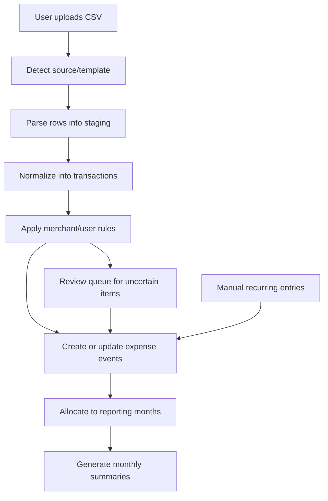

# Finance App Architecture

## Architecture Goal

Design a low-cost, extensible finance app for couples or families that:

- starts simple and is cheap to run for a few users
- supports multiple tabular formats without paid integrations
- handles manual review where bank data is ambiguous
- supports both cash-date and adjusted month summaries
- supports multi-currency normalization into one workspace currency
- supports long-range reporting such as yearly averages and rolling trends
- can later expand to shared-expense balancing and investment dashboards

## Recommended Architecture Style

Start with a **modular monolith**.

That means:

- one web application
- one backend codebase
- one database
- internal modules for expenses, shared settlements, and investments

Do **not** start with microservices.

Why:

- the product is early
- the hardest part is data modeling, not scale
- CSV import and summary logic need strong consistency
- one deployable unit is much cheaper and easier to maintain

## Recommended Stack

## Application stack

- **Frontend + backend:** Next.js with TypeScript
- **API style:** server actions and route handlers for internal app APIs
- **ORM:** Drizzle ORM
- **Validation:** Zod
- **CSV parsing:** `csv-parse` or `papaparse`
- **Excel parsing:** `xlsx` or `exceljs`
- **Charts:** Recharts for simple dashboards
- **Styling:** Tailwind CSS

## Data stack

- **Database:** PostgreSQL
- **Migrations:** Drizzle migrations
- **Jobs:** database-backed async jobs handled by the app itself
- **Caching:** none initially beyond framework defaults

## File storage

For the first version, store uploaded CSV files in the database or on local disk behind a storage abstraction.

Recommendation:

- local development: filesystem storage
- first production version: raw files stored in PostgreSQL as metadata + file path or as stored text/blob for small-scale usage

Reason:

- avoids adding S3 or other storage services too early
- import files are small enough for early usage
- can later move behind a `FileStorage` interface without changing business logic

## Deployment model

Recommended early deployment:

- one Dockerized app
- one PostgreSQL instance

This can run in:

- local Docker Compose
- a self-hosted machine
- or a small VPS

Important note:

There is no realistic long-term production deployment with truly zero cost.
What we can do is avoid **paid product dependencies** and keep infrastructure minimal enough that the app is cheap to run.

## High-Level System Modules

## 1. Auth and workspace module

Responsibilities:

- sign in
- create household workspace
- manage members
- manage roles and permissions

Initial recommendation:

- invite-only app
- email/password or magic-link authentication
- one workspace per couple or household

## 2. Import module

Responsibilities:

- upload CSV files
- detect import source
- map CSV columns
- parse raw rows
- store import history
- handle validation errors

This module is shared by:

- bank imports
- investment imports

## 3. Expense module

Responsibilities:

- normalize bank transactions
- classify transactions
- manage reporting-month allocations
- build monthly summaries
- support manual and recurring entries

This is the most important module for MVP.

## 4. Shared settlement module

Responsibilities:

- mark expenses as shared
- define split rules
- track balances between members
- manage recurring shared items

This should be designed now, but shipped later.

## 5. Investment module

Responsibilities:

- normalize holdings and trade activity
- compute allocation views
- track gain/loss if available
- aggregate multiple investment sources

## 6. Insights module

Responsibilities:

- savings trends
- combined net financial picture
- basic projections such as time-to-goal or retirement estimate

This should come later and read from the expense and investment domains.

## Core Architecture Principle

Do not build reports directly from raw CSV data.

Use a layered pipeline:

1. raw uploaded file
2. parsed import rows
3. normalized financial records
4. user classification and adjustment
5. computed monthly summaries and dashboards

This is what will let us handle:

- multiple bank formats
- CSV and Excel provider files
- overlapping bank statement periods
- shared-expense tagging
- period-based allocation like electricity bills
- recurring manual items like rent
- currency normalization
- long-term period reporting

## Recommended Core Data Model

Below is the minimum strong model I recommend.

## Workspace and identity

### `workspaces`

- id
- name
- base_currency
- created_at

### `users`

- id
- email
- display_name
- created_at

### `workspace_members`

- id
- workspace_id
- user_id
- role
- display_name_override

## Import system

### `import_sources`

Represents known providers such as Bank A, Bank B, Broker X.

- id
- type (`bank`, `investment`)
- name
- country_code

### `import_templates`

Defines how a given CSV format maps into internal fields.

- id
- import_source_id
- template_name
- delimiter
- header_mapping_json
- date_format
- amount_rules_json
- active

### `imports`

Represents one uploaded file.

- id
- workspace_id
- uploaded_by_user_id
- import_source_id
- import_template_id
- type (`bank`, `investment`)
- original_filename
- import_status
- file_kind (`csv`, `xlsx`)
- started_at
- completed_at
- error_summary

### `import_rows`

Optional staging table for traceability and debugging.

- id
- import_id
- row_index
- raw_data_json
- parse_status
- parse_error

## Expense domain

### `financial_accounts`

Bank accounts or cards connected only through imports.

- id
- workspace_id
- owner_member_id
- account_type
- display_name
- import_source_id
- external_account_label

### `transactions`

Normalized cash movement records from bank imports.

- id
- workspace_id
- account_id
- import_id
- transaction_date
- booking_date
- description
- merchant_raw
- original_currency
- original_amount
- settlement_currency nullable
- settlement_amount nullable
- workspace_currency
- normalized_amount
- normalization_rate nullable
- normalization_rate_source nullable
- direction
- external_reference
- dedupe_hash

Important note:

Some imported files may only clearly expose the settlement currency for a section of the statement.
The parser should preserve the statement section context so normalization remains explainable.

### `transaction_classifications`

Stores how a user interprets a transaction.

- id
- transaction_id
- classification_type (`personal`, `shared`, `household`, `income`, `transfer`, `ignore`)
- member_owner_id nullable
- category
- confidence
- decided_by (`rule`, `user`, `system-default`)
- reviewed_at

### `classification_rules`

Merchant or pattern rules learned from user choices.

- id
- workspace_id
- match_type (`contains`, `regex`, `exact`)
- match_value
- default_classification_type
- default_member_owner_id nullable
- default_category nullable
- priority
- active

### `expense_events`

This is the key abstraction.
An expense event is the reporting object used by monthly summaries.

- id
- workspace_id
- source_type (`transaction`, `manual`, `recurring`)
- source_id
- title
- total_amount
- classification_type
- payer_member_id nullable
- category
- reporting_mode (`payment_date`, `allocated_period`)
- event_kind (`expense`, `income`)

### `expense_allocations`

Allows one expense event to be assigned across one or more months.

- id
- expense_event_id
- report_month
- allocated_amount
- allocation_method (`single_month`, `equal_split`, `manual_split`)
- coverage_start_date nullable
- coverage_end_date nullable

Examples:

- grocery purchase in July -> one allocation for July
- electricity bill paid in August for May and June -> two allocations, one for May and one for June

### `manual_recurring_expenses`

For rent, check-based payments, cash routines, and similar entries.

- id
- workspace_id
- title
- event_kind (`expense`, `income`)
- payer_member_id nullable
- classification_type
- category
- active

### `recurring_entry_versions`

Versioned definitions for recurring income and expenses.

- id
- recurring_entry_id
- effective_start_month
- effective_end_month nullable
- amount
- currency
- normalization_mode (`monthly_average`, `fixed_rate`, `none`)
- recurrence_rule
- notes nullable

This is how rent or salary can change over time without modifying already generated historical periods.
For salaries and other recurring income, this version can act as the expected default amount for future generated entries.

### `manual_entries`

One-time or generated manual entries that feed reporting exactly like imported entries.

- id
- workspace_id
- source_type (`one_time_manual`, `recurring_generated`)
- source_id nullable
- event_kind (`expense`, `income`)
- title
- original_currency
- original_amount
- workspace_currency
- normalized_amount
- payer_member_id nullable
- category
- event_date

### `manual_entry_overrides`

Optional explicit correction records for generated recurring entries.

- id
- manual_entry_id
- override_type (`amount`, `date`, `category`, `payer`, `skip`)
- old_value_json
- new_value_json
- changed_at

This is useful for cases like:

- salary came in lower or higher than usual
- one-time bonus should be attached to a salary period
- a recurring item should be skipped for one month

## Shared settlement domain

### `shared_expense_splits`

- id
- expense_event_id
- split_mode (`equal`, `percentage`, `fixed`)
- split_definition_json
- settlement_status (`open`, `settled`, `ignored`)

### `member_balances`

Can be computed on the fly at first.
No need to store unless performance later requires it.

## Investment domain

### `investment_accounts`

- id
- workspace_id
- owner_member_id nullable
- display_name
- import_source_id
- account_currency

### `investment_activities`

Normalized imported activity records.

- id
- workspace_id
- investment_account_id
- import_id
- activity_date
- asset_symbol nullable
- asset_name
- activity_type (`buy`, `sell`, `dividend`, `fee`, `cash_in`, `cash_out`)
- quantity nullable
- unit_price nullable
- total_amount nullable
- currency

### `holding_snapshots`

Represents imported or computed holdings at a point in time.

- id
- workspace_id
- investment_account_id
- snapshot_date
- asset_name
- asset_symbol nullable
- asset_type (`cash`, `index`, `stock`, `fund`, `bond`, `other`)
- quantity nullable
- market_value
- cost_basis nullable
- gain_loss nullable
- currency

## Summaries

### `period_summaries`

Cached summary snapshots for faster dashboard loading.

- id
- workspace_id
- period_type (`month`, `quarter`, `year`, `rolling_12m`)
- period_start
- period_end
- summary_type (`cash`, `adjusted`)
- generated_at
- summary_json

These can always be recomputed from source records.

The API should still expose “monthly summaries”, but the cache model should not be limited to months only.

## Currency normalization

The reporting layer should operate in the workspace main currency.

Recommended model:

### `exchange_rate_monthly`

- id
- base_currency
- quote_currency
- year_month
- average_rate
- source_name
- fetched_at

Recommended calculation rule:

- for reporting, use the monthly average exchange rate of the transaction month
- store the original amount and currency
- store the normalized amount used in reporting

Why monthly average:

- consistent with budgeting and year-average reporting
- stable enough for household analytics
- avoids noisy day-by-day FX changes for personal finance summaries

Important note:

FX normalization is a reporting decision, not a replacement for the original transaction record.

## Expense Processing Flow

This is the most important flow in the system.

## How To Solve The Hard Expense Cases

## 1. Shared expenses that CSV cannot explain

Recommended approach:

- auto-import all transactions
- auto-apply saved merchant rules where possible
- place uncertain items in a review queue
- let the user confirm only those items

This avoids full manual review every month.

Good UX pattern:

- “12 transactions need review”
- bulk actions like:
  - mark as household
  - mark as shared
  - assign to member A
  - assign to member B
  - save as future rule

## 2. Bills paid later than the period they belong to

Model these through `expense_events` plus `expense_allocations`.

User flow:

- import August payment
- mark transaction as electricity bill
- set coverage period May 1 to June 30
- app splits amount across May and June

This is much better than mutating the original transaction date.

## 3. Recurring expenses missing from CSV

Use `manual_recurring_expenses`.

User flow:

- create rent rule
- choose monthly recurrence
- assign payer and classification
- auto-generate monthly expense events

This lets the monthly summary reflect the real household budget even when bank CSVs are incomplete.

## Summary Computation Strategy

Support two summary modes from the same underlying data.

## Cash summary

Based on actual payment dates.

Useful for:

- bank reconciliation
- actual cash outflow tracking

## Adjusted summary

Based on `expense_allocations.report_month`.

Useful for:

- understanding what each month really cost
- budgeting
- savings analysis
- later planning calculations

For MVP, the main household dashboard should use the adjusted summary, while advanced users can also inspect the cash view.

## Period reporting strategy

The reporting service should support aggregations over:

- calendar month
- quarter
- calendar year
- trailing 12 months

This matters because the product should emphasize:

- yearly averages
- long-term category trends
- average savings rate
- unusual months versus normal behavior

So “monthly summary” should be treated as one reporting slice, not the final reporting abstraction.

## Job Design

Do not introduce a separate queue system yet.

Use simple database-backed jobs handled by the app for:

- import parsing
- normalization
- summary regeneration
- recurring expense generation

Recommended initial pattern:

- insert a job row
- worker loop in the app processes pending jobs
- mark success or failure

Later, if needed, this can move to a dedicated queue library without changing core logic.

## API and Module Boundaries

Keep module boundaries clean even inside the monolith.

Recommended internal modules:

- `auth`
- `workspaces`
- `imports`
- `expenses`
- `settlements`
- `investments`
- `insights`
- `shared`

Each module should own:

- database queries for its tables
- domain services
- validators
- API handlers

Avoid cross-module table writes except through explicit service calls.

## Security and Privacy

Recommended baseline:

- encrypted database backups
- session-based auth with secure cookies
- audit log for imports and critical edits
- soft delete for user-generated finance records
- never send financial CSVs to third-party AI services

## Recommended First Build Order

## Milestone 1: Foundation

- auth
- workspace creation
- member management
- database schema
- import source/template framework

## Milestone 2: Expense MVP

- bank CSV upload
- transaction normalization
- merchant rule engine
- review queue
- expense events and allocations
- monthly summary page

## Milestone 3: Manual budget completion

- recurring manual expenses
- manual one-off entries
- summary recomputation

## Milestone 4: Shared settlement

- mark shared expenses
- split logic
- running balance

## Milestone 5: Investment MVP

- investment CSV upload
- holdings snapshots
- basic allocation dashboard

## Architecture Recommendation

If we build this now, I strongly recommend:

- **Next.js + TypeScript**
- **PostgreSQL**
- **Drizzle**
- **single deployable app**
- **modular monolith structure**
- **expense events + expense allocations as the core reporting model**

That gives us the cleanest path to support your hard cases without adding paid tools or unnecessary infrastructure.
