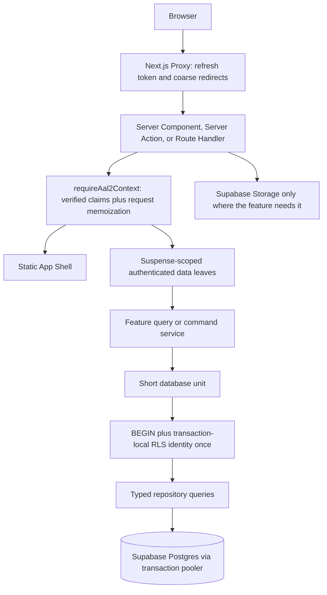

# Production Performance and Architecture Refactor Plan

## Status

- Status: Active execution plan; Tracks 0–5 implemented, PREFETCH-001 next
- Reviewed: 2026-08-13
- Source investigation: `docs/production-performance-investigation-spec.md`
- Repository baseline: commit `b667bfd`
- Delivery model: small, dependency-aware tasks; no bulk rewrite

## Review outcome

The investigation spec identifies the correct primary causal chain. The strongest
production evidence is still the steady-state advisory-lock wait, followed by repeated
Auth calls, per-query RLS setup, and reporting writes during reads. Pool size and indexes
should remain late optimizations.

The draft should be extended in several areas before implementation:

1. **Runtime support is now a prerequisite.** The repository now targets Node `22.14.0`,
   satisfying the current Supabase JavaScript client requirement. PLATFORM-001 owns this
   runtime contract; hosted readiness rejects non-Node-22 deployments.
2. **The requested Next.js workflows cannot run on the current framework.** The installed
   version is Next.js `15.5.14`; Cache Components optimization and Partial Prefetching
   require Next.js `16.3+`.
3. **The current render architecture opts out of an instant shell.** The authenticated
   layout and most data-heavy pages are forced dynamic, the layout awaits workspace data
   before rendering, there are no Suspense boundaries in `src/`, and one coarse
   `(app)/loading.tsx` replaces the whole page with “Loading workspace…”.
4. **Navigation prefetching is manually disabled.** The app shell applies
   `prefetch={false}` to its links and calls `router.prefetch()` on hover/focus. Partial
   Prefetching should eventually replace this custom strategy with the default shared
   App Shell, with explicit runtime prefetch only for selected URL-specific destinations.
5. **The client boundary is too broad in several features.** Seven client components are
   over 500 lines, with the largest at 1,738 lines. Recurring and settlements also fetch
   their initial data after hydration even though their pages are Server Components.
6. **The current Playwright rig is not a performance/navigation rig.** It runs against
   `next dev`. Instant-shell checks must use a production build with the Next.js testing
   API explicitly enabled outside production.
7. **Request-scoped memoization and cross-request caching must be separated.** React
   `cache()` is appropriate for sharing verified context inside one Server Component
   render. `use cache` is not a blanket solution for authenticated financial data.
8. **A database unit is not the whole page render.** Transaction-scoped RLS should mean a
   short, cohesive query/command unit. It must not hold one transaction open while React
   streams or while Auth, Storage, or other network work runs.
9. **MFA needs defense in depth.** Proxy can refresh tokens and perform coarse redirects,
   but pages, Server Actions, and Route Handlers must share a server-side
   `requireAal2Context()` contract. The current workspace helper verifies a user but does
   not independently enforce `aal2`.
10. **Existing privileged database helpers need an explicit audit.** The `app` schema has
    several `SECURITY DEFINER` RLS helpers. Their ownership, fixed `search_path`, schema
    exposure, and `EXECUTE` grants should be verified; no new `SECURITY DEFINER` helper
    should be introduced merely to simplify application queries.

## Current baseline

The current repository passes:

- ESLint
- TypeScript with `--noEmit`
- 12 focused review-domain tests
- a Next.js 15 production build

The production build currently reports:

- every application route as dynamic;
- 102 kB shared first-load JavaScript;
- 121 kB first-load JavaScript for `/imports/review`, the largest route;
- 89.9 kB middleware output;
- one global loading boundary and no explicit Suspense boundary in application code.

These numbers are a compatibility baseline, not yet a user-performance baseline. The
first task must add measurements for hard navigation, soft navigation, useful shell,
Auth calls, SQL round trips, and mutation duration.

## Target architecture

The boundaries are intentional:

- Proxy is not the sole authorization layer.
- Auth context is memoized per Server Component render, never globally by user.
- Static shell content contains no user or workspace data.
- User-specific reads stay fresh behind Suspense unless a separate task defines a safe
  private cache and invalidation policy.
- Services receive an explicit database executor when atomicity or RLS scope matters.
- Route Handlers remain appropriate for uploads and externally addressable HTTP APIs.
- Same-app form mutations may move to Server Actions feature by feature when that reduces
  client orchestration without weakening validation or authorization.

## Delivery rules

Every task below must:

- preserve RLS, MFA, redirect, empty, error, and rollback behavior;
- include its own automated regression coverage;
- record before/after measurements for the behavior it claims to improve;
- avoid unrelated visual redesign;
- remain independently revertible;
- use a production build for prefetch and instant-navigation claims;
- use both desktop and mobile viewports when changing a shell or skeleton.

For cache freshness, the safe default is to keep the read request-time and move it behind
Suspense. Do not invent `cacheLife` values for financial, workspace, or authorization data.

## Work breakdown

### Track 0 — Measurement and guardrails

#### PERF-001: Add success-path stage instrumentation

Scope:

- Add a request/operation correlation ID.
- Add structured spans for verified claims, MFA/context resolution, pool acquisition,
  RLS setup, workspace lookup, reporting projection, and route/command completion.
- Count Auth calls, database units, SQL statements, and RLS setup calls.
- Hash or omit user/workspace identifiers; never log cookies, tokens, secrets, or rows.

Acceptance:

- One slow request can be reconstructed from structured logs.
- Successful requests produce duration data, not only errors.
- Instrumentation overhead is measured and kept small.

#### PERF-002: Add a repeatable browser benchmark

Scope:

- Keep the current functional E2E project.
- Add a separate production-build benchmark for hard and soft navigation.
- Cover `/`, `/imports`, `/imports/review`, `/expenses`, `/reports`, a single save, a
  bulk save, and a small import.
- Record cold and warm distributions plus stage/query/Auth counts.

Acceptance:

- A single command produces comparable JSON or CSV results.
- The pre-refactor baseline is checked into the investigation artifact or attached to
  the first task.

#### PERF-003: Define performance budgets

Scope:

- Confirm the investigation spec's server-duration targets after PERF-002.
- Add p75 Core Web Vitals targets: LCP, INP, and CLS.
- Add amplification budgets: Auth calls, workspace resolutions, SQL statements, RLS
  setups, writes on GET, and client JavaScript per route.

Acceptance:

- Budgets distinguish hard navigation, soft navigation, reads, and mutations.
- A regression threshold is defined before optimization tasks begin.

### Track 1 — Runtime and framework foundation

#### PLATFORM-001: Move the repository to Node 22

Scope:

- Update `engines`, `.nvmrc`, Vercel/runtime configuration, hosted readiness checks, and
  documentation.
- Run backup, import parsing, Playwright, Drizzle, `pg`, and Supabase smoke checks.

Acceptance:

- Local and hosted-compatible builds run on Node 22.
- No Node 20-only check remains.

#### PLATFORM-002: Make dependency installation reproducible

Scope:

- Standardize on npm because the repository commits `package-lock.json` and uses npm
  scripts; remove the Yarn `packageManager` declaration.
- Pin runtime/security-sensitive packages intentionally rather than allowing unreviewed
  minor drift through broad ranges.
- Document the upgrade cadence for Next.js, React, Supabase, Drizzle, and `pg`.

Acceptance:

- `npm ci` is the single supported install path.
- A clean install produces the same dependency graph used by CI and Vercel.

#### PLATFORM-003: Upgrade Next.js to 16.3 without enabling Cache Components

Scope:

- Run the official Next.js upgrade codemod.
- Upgrade Next.js, React, React DOM, types, and ESLint config as one compatibility task.
- Rename `src/middleware.ts` and its export to the Next.js 16 `proxy` convention.
- Preserve current dynamic rendering and behavior during this task.

Acceptance:

- Build, lint, unit tests, E2E tests, Auth redirects, MFA, uploads, and RLS smoke pass.
- No Cache Components or Partial Prefetching behavior change is included yet.

#### PLATFORM-004: Update Supabase clients and verified-claims usage

Scope:

- Update `@supabase/supabase-js` and `@supabase/ssr` on Node 22.
- Use `getClaims()` for verified identity and `aal` where the project's signing-key mode
  supports local JWKS verification; retain `getUser()` only for fresh user-record needs.
- Keep one Supabase client object per request.
- Add an explicit `requireAal2Context()` helper shared by RSC, Actions, and Route Handlers.

Acceptance:

- Protected entry points reject missing, invalid, and `aal1` sessions.
- Auth `/user` and MFA network-call counts fall to the expected minimum.
- A fresh user-record lookup remains available only at named call sites that need it.

### Track 2 — Remove measured serialization and duplicated context

#### CONTEXT-001: Remove the advisory lock from established-user lookup

Scope:

- Add a read-only fast path for an existing app user, active membership, and workspace.
- Enter bootstrap logic only when required state is absent.
- Keep the change independent of the final onboarding redesign.

Acceptance:

- An ordinary page/API request makes zero per-user advisory-lock calls.
- Concurrent requests for one established user do not serialize.
- Two simultaneous missing-user requests cannot create duplicates.

#### CONTEXT-002: Make onboarding the owner of bootstrap mutation

Scope:

- Move normal hosted context resolution to a read-only operation.
- Make onboarding creation idempotent with uniqueness constraints and conflict handling.
- Define a separate, observable repair path for partial legacy state.
- Preserve multiple workspace memberships and make the selected workspace explicit in
  the route, using `/w/[workspaceSlug]/...`. Keep `/` as a resolver/redirect to the
  user's only or most recently selected workspace during the transition.

Acceptance:

- Rendering never creates an application user, workspace, member, or starter categories.
- Onboarding concurrency tests pass.
- No global uniqueness constraint limits one user to one workspace.
- Every workspace-scoped entry point verifies that the authenticated user has an active
  membership in the workspace named by the route.
- Partial state produces a recoverable product outcome rather than hidden repair work in
  every request.

#### CONTEXT-003: Introduce one authenticated request-context service

Scope:

- Return verified subject, `aal`, app user, selected membership, and workspace.
- Memoize the exported Server Component resolver once with React `cache()` at module
  scope so layout and page share the same promise during one render.
- In Route Handlers and Actions, create one context at the entry point and pass it down.
- Replace broad callback nesting with narrower query and command helpers over time.

Acceptance:

- Layout and page share one context result.
- The helper is not a cross-request or cross-user cache.
- Security tests cover RSC, Route Handlers, and Server Actions independently.

### Track 3 — Make the database security boundary explicit

#### DB-001: Introduce a transaction-scoped executor

Scope:

- Define a typed `DbExecutor` used consistently by repositories/services.
- For each cohesive unit, acquire a client, begin, set
  `app.current_user_id` with transaction-local scope once, run queries, and finish.
- Prohibit Auth, Storage, file parsing, or other network work inside an open transaction.

Acceptance:

- RLS setup is approximately one call per database unit, not one per statement.
- Transactions are short and visible in instrumentation.
- A failed unit rolls back and releases its connection.

#### DB-002: Migrate reads and commands off the global query wrapper

Scope:

- Migrate one feature at a time: workspace/home, classifications, imports, recurring,
  reporting, settlements, investments.
- Remove the `PoolClient.query` monkey patch only after all callers use an explicit unit.
- Replace ineffective `Promise.all` fan-out on a one-connection pool with deliberate
  query batching or a small number of shaped queries.

Acceptance:

- No application query depends on ambient per-statement identity mutation.
- Query counts decrease for each migrated scenario.
- Service functions can be unit-tested with an explicit executor.

#### DB-003: Expand RLS and privileged-function tests

Scope:

- Test pooled connection reuse across users, rollback, thrown errors, and concurrent
  requests.
- Audit every existing `SECURITY DEFINER` helper for owner, fixed `search_path`, schema
  exposure, and least-privilege `EXECUTE` grants.
- Run Supabase security and performance advisors after schema/security changes.

Acceptance:

- User A cannot read or mutate user B's workspace through any tested path.
- A reused connection never retains the prior identity.
- Advisor findings are fixed or documented with rationale.

### Track 4 — Remove write-on-read reporting work

#### REPORTING-001: Define the projection invalidation matrix

Scope:

- List every mutation that affects expense events, allocations, and period summaries.
- Specify affected source IDs/months and required atomicity for each command.
- Decide whether short eventual consistency is acceptable; default to synchronous,
  incremental updates at the current product scale.

Acceptance:

- Every derived table has a documented owner and rebuild source.
- No mutation path is omitted.

#### REPORTING-002: Incrementally update projections from classification/manual commands

Scope:

- Update only affected transaction/manual source IDs and months.
- Avoid delete/reinsert when rows are unchanged.
- Keep source and derived changes atomic where partial state is harmful.

Acceptance:

- Single and bulk classification query counts are bounded and measured.
- Reporting correctness tests cover create, update, undo, and delete.

#### REPORTING-003: Incrementally update projections from import/recurring commands

Scope:

- Update only imported or generated source IDs.
- Preserve recoverable file-cleanup behavior outside the critical database transaction.

Acceptance:

- Small import and recurring changes are proportional to changed rows.
- Failure tests prove the canonical source can be retried or repaired.

#### REPORTING-004: Make home and reports read-only

Scope:

- Remove `syncExpenseEventsForRange()` from page rendering.
- Add an idempotent repair/rebuild command for historical consistency.
- Reduce the homepage read model to above-the-fold and next-action data; stream secondary
  reporting and activity independently.

Acceptance:

- `GET /` and report renders perform zero application-table writes.
- Repeated reads do not update timestamps or recreate allocations.
- The repair command restores projections from canonical sources.

### Track 5 — Adopt Cache Components and instant route shells

#### NAV-000: Add the instant-navigation production rig

Scope:

- Add `@next/playwright` on the exact Next.js release line.
- Create and commit `instant-nav.rig.md` with build, testing-API gate, run command, test
  user, environment drift, loop, liveness, and known walls.
- Keep the existing dev E2E config; add a production-build config for instant checks.

Acceptance:

- The testing API is enabled for measured local/preview builds and never production.
- The authenticated session is injected without navigating the measured page.
- A self-validating test proves dynamic content is actually locked.

#### NAV-001: Enable `cacheComponents` and resolve build blockers

Scope:

- Enable `cacheComponents: true` only after Next.js 16.3 is stable.
- Remove incompatible `dynamic = "force-dynamic"` escape hatches deliberately.
- Use scoped debug builds to inventory request data, uncached SQL, URL data, time, and
  other prerender blockers.
- Keep fresh reads behind Suspense instead of caching them by default.

Acceptance:

- The complete production build passes with Cache Components.
- No authenticated/user-specific value is placed in a shared cache accidentally.

#### NAV-002: Refactor the authenticated app shell

Scope:

- Render the stable frame, brand, navigation labels, and page slot synchronously.
- Split pathname/mobile interactivity into the smallest practical Client Components.
- Stream workspace name, member count, and review badge in focused boundaries.
- Replace the coarse global loading page with shell-aligned, responsive skeletons.

Acceptance:

- The shell appears before Auth/workspace/database data resolves.
- No unauthorized financial data is rendered or prefetched.
- Open navigation state, focus, and scroll survive streamed leaf completion.
- Hard and soft shell tests pass at desktop and mobile widths.

#### NAV-003 through NAV-010: Optimize one feature route per task

Use this order:

| Task | Route | Primary change |
| --- | --- | --- |
| NAV-003 | `/` | Static heading/next-action frame; stream workflow, reporting, and activity leaves |
| NAV-004 | `/imports/review` | Keep header/filter frame in shell; defer URL query and queue data |
| NAV-005 | `/expenses` | Keep ledger frame/actions in shell; defer URL-selected transaction and ledger data |
| NAV-006 | `/reports` | Keep heading and controls in shell; defer month/mode-specific report regions |
| NAV-007 | `/settings` | Stream settings/member/category data into small interactive regions |
| NAV-008 | `/recurring` | Server-load initial data; remove hydration-time blank/loading waterfall |
| NAV-009 | `/settlements` | Server-load initial balance/data; remove hydration-time blank/loading waterfall |
| NAV-010 | `/imports` and `/investments` | Keep upload interaction client-side; stream saved history and holdings separately |

Each route task must:

1. Establish an unlocked hard/soft baseline for the test user.
2. Add a failing `instant()` shell assertion.
3. Hoist static/LCP UI and push Suspense down to the exact data read.
4. Reuse or extract the feature's real loading UI; do not duplicate the whole page.
5. Prove parity for data, redirects, errors, empty states, and interactions.
6. Show the differential: without the route fix the guard fails; with it the guard passes.
7. Ship the locked test as the regression guard.

### Track 6 — Adopt Partial Prefetching

#### PREFETCH-001: Audit the existing navigation strategy with the flag off

Scope:

- Inventory `prefetch`, `router.prefetch`, and any link wrappers across the whole source
  tree.
- Record that the current app has manual `prefetch={false}` plus imperative hover/focus
  prefetching rather than `prefetch={true}`.
- Adopt destinations incrementally if the migration tooling requires route exports.

Acceptance:

- Every custom prefetch site has an explicit keep/remove decision.
- No navigation behavior is silently lost.

#### PREFETCH-002: Enable Partial Prefetching globally

Scope:

- Enable `partialPrefetching: true` next to `cacheComponents: true`.
- Remove temporary route adoption exports with the first-party codemod.
- Sweep the app feature by feature in `next dev`, using the overlay/dev log to find URL
  data and blocking shell reads.
- Verify the result under `next build && next start`, because actual prefetching is a
  production behavior.

Acceptance:

- Default app links prefetch the shared App Shell.
- Production soft navigations commit the intended non-empty shell immediately.
- Build, functional E2E, and all instant-shell guards pass.

#### PREFETCH-003: Decide runtime prefetch candidates separately

Likely candidates are URL-specific links to:

- `/reports?month=...&mode=...`
- `/expenses?transactionId=...`
- `/imports/review?...`

For each candidate, decide whether preloading its URL-specific data is worth one server
render per prefetchable link. Prefer the shared shell default. Use targeted
`<Link prefetch={true}>` only after documenting freshness, authorization, invalidation,
and server-cost trade-offs.

Acceptance:

- No unresolved runtime-prefetch marker remains.
- Every explicit full/runtime prefetch is verified in a production run.

### Track 7 — Reduce client islands feature by feature

Do not start a repository-wide component rewrite. Apply this checklist inside NAV tasks or
as a follow-up for one feature:

1. Render read-only structure and initial data in Server Components.
2. Keep state, browser APIs, focus management, file inputs, and immediate editing controls
   in small Client Components.
3. Extract pure reducers/formatters/validators from large client files and test them.
4. Prefer URL/search params for shareable filter state.
5. Use Server Actions with `useActionState`/`useOptimistic` for same-app form mutations
   when they simplify orchestration; keep Route Handlers for uploads and true HTTP APIs.
6. Revalidate or update only affected read models after mutation.
7. Add `server-only` markers to database, Auth, secrets, storage-admin, and command modules.

Priority:

1. Recurring and settlements, because they currently fetch initial data after hydration.
2. Review queue and expenses, because they are the largest and most-used client islands.
3. Settings.
4. Imports and investments, preserving client-side file input/parsing needs.

Acceptance per feature:

- No initial client fetch is required for data the server already has.
- Client JavaScript decreases or a documented interaction need explains why it does not.
- Keyboard, focus, accessibility, optimistic state, error, and undo behavior remain covered.

### Track 8 — Index, region, and pool tuning

#### TUNING-001: Add evidence-backed indexes

Scope:

- Review Supabase advisor findings against actual joins, deletes, and orderings.
- Test representative data with `EXPLAIN (ANALYZE, BUFFERS)` in a safe environment.
- Apply reviewed migrations and rerun security/performance advisors.

Acceptance:

- Findings are fixed or waived with evidence.
- Indexes target production query shapes, not only foreign-key presence.

#### TUNING-002: Align compute region and tune the pool

Scope:

- Log actual Vercel function region and compare it with Supabase Tokyo.
- After earlier tasks, benchmark pool sizes one, two, and three.
- Monitor application pool wait, Supavisor usage, errors, and cold/warm latency.

Acceptance:

- Region placement is intentional.
- The smallest pool meeting latency targets is documented.
- No connection-pressure regression is introduced.

## Recommended execution order

```mermaid
flowchart LR
    A["PERF-001..003"] --> B["PLATFORM-001..002"]
    B --> C["CONTEXT-001 hot-path fix"]
    C --> D["PLATFORM-003 Next 16.3"]
    D --> E["PLATFORM-004 plus CONTEXT-002..003"]
    E --> F["DB-001..003"]
    F --> G["REPORTING-001..004"]
    G --> H["NAV-000..002"]
    H --> I["NAV-003..010, one route at a time"]
    I --> J["PREFETCH-001..003"]
    J --> K["TUNING-001..002"]
```

Client-island reductions happen within the relevant route task, not as one final rewrite.
The advisory-lock fast-path task is deliberately early because it addresses the strongest
measured production wait and can ship independently of the rendering migration.

## Suggested task/PR slices

1. Measurement primitives and baseline artifact.
2. Node 22 and npm/tooling consistency.
3. Established-user no-lock fast path plus concurrency tests.
4. Next.js 16.3 compatibility upgrade and Proxy rename, with behavior unchanged.
5. Supabase client update plus verified `aal2` request context.
6. Explicit onboarding/bootstrap and request memoization.
7. Transaction-scoped DB executor for workspace/home, then one feature per follow-up.
8. Classification/manual projection updates.
9. Import/recurring projection updates and read-only home/report paths.
10. Cache Components build adoption and instant-navigation rig.
11. App-shell static frame.
12. One task per route in the NAV table.
13. Partial Prefetching audit and global adoption.
14. Runtime-prefetch decisions as a separate change.
15. Indexes, region, and pool tuning after new measurements.

## Resolved architecture decisions

### Workspace tenancy and selection

- Keep the existing many-to-many user/workspace membership model.
- Support one selected workspace at a time in the UI, without restricting how many
  active workspaces a user may belong to.
- Make workspace identity explicit in URLs with `/w/[workspaceSlug]/...`; a slug is a
  routing key, never an authorization credential.
- Keep `/` and the current unscoped routes as temporary resolvers/redirects so the URL
  migration can ship independently.
- Include workspace identity in request, query, mutation, and any future cache keys.
- Verify active membership on every protected Server Component, Server Action, and Route
  Handler entry point.

This adds a modest routing task now but avoids hidden cookie state, ambiguous `findFirst`
membership selection, and future cache/prefetch collisions between workspaces.

### Reporting consistency

- Use synchronous, incremental projection updates in the same transaction as the source
  mutation when partial state would be harmful.
- Keep an idempotent rebuild/repair command.
- Do not add asynchronous projection jobs unless post-refactor measurements show that the
  synchronous incremental work cannot meet the mutation budgets.

### Test environments

- Use local Supabase for normal development, PR tests, destructive tests, migration
  iteration, and the fast production-build instant-navigation loop.
- Create a separate hosted Free project named `finapp-test` in the same region as
  production for Supabase Auth/MFA/RLS/Storage and Vercel Preview smoke tests.
- Never clone production financial data into the test project. Apply migrations and load
  a small deterministic synthetic seed instead.
- Maintain dedicated test users, including a stable `aal2` user and two isolated
  workspaces for RLS checks. Store test credentials and any TOTP seed only in local/CI
  secret storage.
- The account currently exposes one active Supabase project. Supabase documents a limit
  of two active Free projects across organizations where the user is Owner/Admin, so the
  hosted test project should consume the remaining slot if no other organization member
  has already consumed the shared allowance.
- Do not use Supabase Preview Branches while zero cost is a requirement; branches consume
  billable compute. Accept that an inactive Free test project may pause and require a
  wake-up step.

### Navigation verification

- Treat local `next build && next start` against local Supabase as the fast deterministic
  instant-navigation rig.
- Run a smaller hosted smoke suite against Vercel Preview plus `finapp-test` to cover real
  Auth, network, region, and pooler behavior.
- Use a commit-SHA liveness probe for Preview runs.

### Runtime prefetching

- Start with shared App Shell prefetching only.
- Do not add URL-specific `prefetch={true}` during the initial adoption.
- Add it later only for a measured, high-value navigation whose freshness, authorization,
  invalidation, and server-render cost are documented.

### Data platform and jobs

- Keep direct Postgres through Supavisor transaction mode as the primary data path.
- Do not migrate read surfaces to the Data API during this refactor.
- Do not introduce Redis, a general cache service, or an asynchronous job platform unless
  measurements after the core fixes establish a concrete need.

## Explicit non-goals for this refactor

- No microservices split.
- No general Redis/cache layer.
- No blanket `use cache` on authenticated data.
- No pool-size increase before request amplification is removed.
- No wholesale Data API migration while direct Postgres remains measurable and reliable.
- No asynchronous job platform until incremental synchronous projections are shown to be
  insufficient.
- No visual redesign bundled with the performance work.

## Final completion criteria

The refactor program is complete when:

- the investigation latency targets and agreed Core Web Vitals budgets hold;
- ordinary requests do not take the bootstrap advisory lock;
- each server entry point resolves one verified `aal2` context;
- RLS identity is transaction-local and cannot leak across pooled users;
- home and report reads perform no projection writes;
- high-value routes have non-empty hard and soft static shells guarded by `instant()`;
- default links use Partial Prefetching and runtime prefetch is limited to documented cases;
- initial feature data is server-rendered and interactive code is scoped to necessary
  client islands;
- security, parity, accessibility, and mutation correctness suites remain green;
- region, pool, and index choices are supported by post-refactor measurements.

## References

- Next.js 16 upgrade: https://nextjs.org/docs/app/guides/upgrading/version-16
- Next.js Cache Components: https://nextjs.org/docs/app/api-reference/config/next-config-js/cacheComponents
- Next.js Server and Client Components: https://nextjs.org/docs/app/getting-started/server-and-client-components
- React request-scoped `cache()`: https://react.dev/reference/react/cache
- Supabase Next.js SSR/Auth guide: https://supabase.com/docs/guides/getting-started/tutorials/with-nextjs
- Supabase MFA: https://supabase.com/docs/guides/auth/auth-mfa
- Supabase Postgres connections: https://supabase.com/docs/guides/database/connecting-to-postgres
- Supabase connection management: https://supabase.com/docs/guides/database/connection-management
